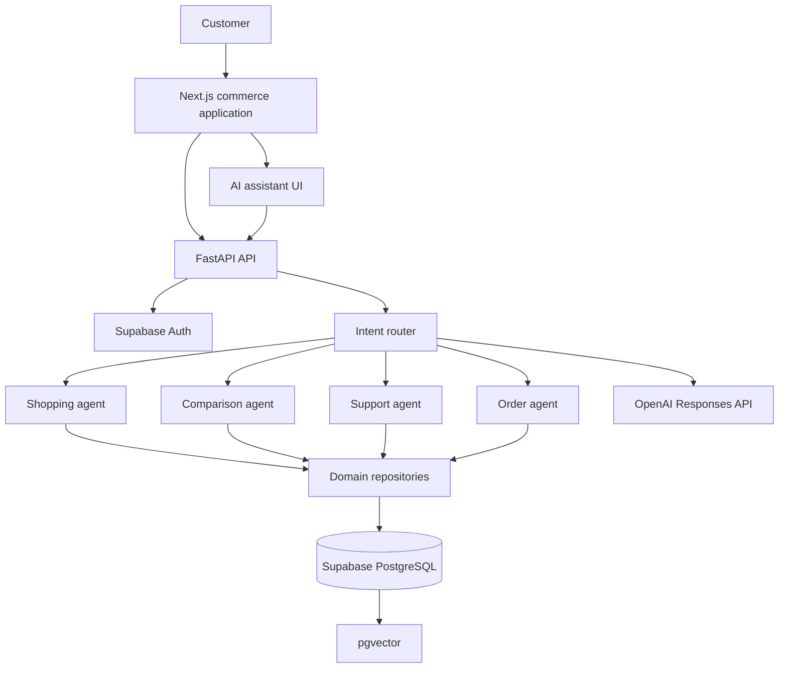

# ACE Platform Architecture

ACE separates conventional commerce from AI assistance. Every shopping operation remains available without an AI provider.

## Boundaries

- The frontend never receives privileged Supabase or OpenAI credentials.
- FastAPI verifies Supabase JWTs and owns AI orchestration.
- Repositories are the only path to catalogue and order records.
- Retrieved records are passed to the model as bounded context.
- The model explains or ranks known records; it cannot create products.
- A deterministic local retrieval path keeps development usable without cloud credentials.

## Current agent set

Shopping, recommendation, comparison, FAQ support, order tracking, return orchestration, feedback capture, and user-scoped analytics are operational. The intent router dispatches both dedicated API calls and natural-language chat requests to the appropriate agent. Operational events feed the analytics agent without exposing service-role credentials to the browser.
